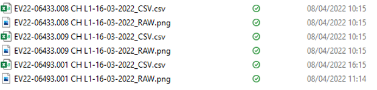
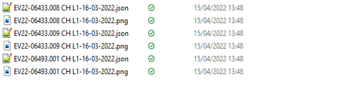
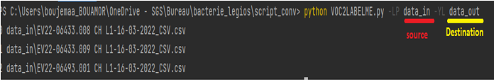
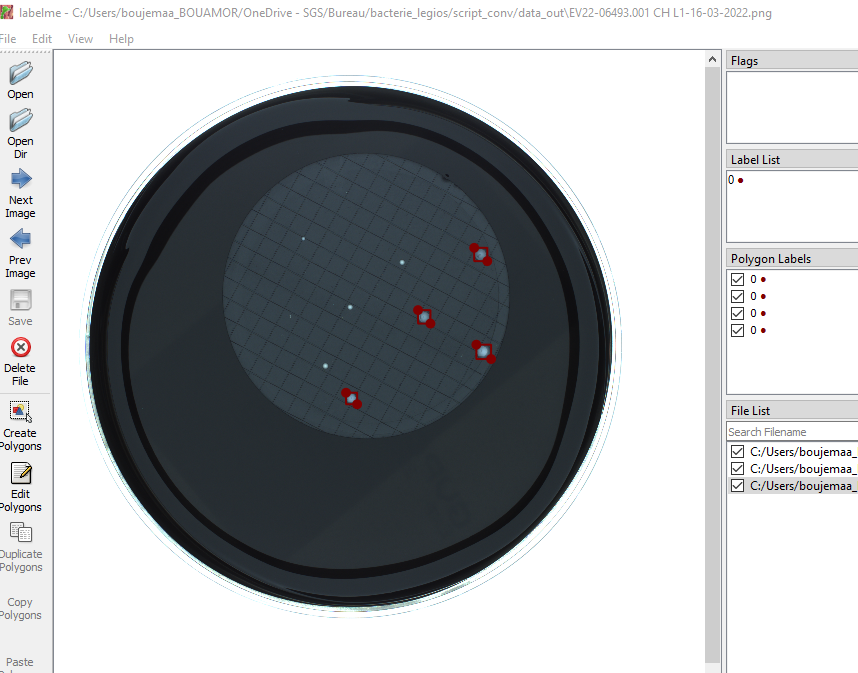
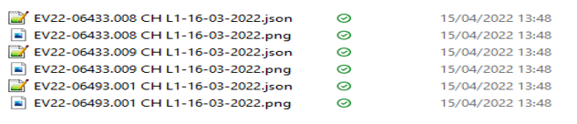
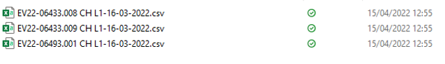
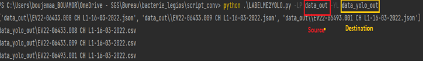

Projet annotations Labelme
---


### Mode opératoire 
Ce document est un mode opératoire pour savoir comment utiliser les deux programmes : 
-Le premier programme « *PASCAL_VOC2LABELME.py* » sert à convertir les annotations PASCAL VOC vers les annotations Labelme 
-Le deuxième programme « *LABELME2YOLO.py* » sert à convertir les annotations Labelme vers les annotations YOLO PASCAL 

## PASCAL VOC vers Labelme 
Les annotations Pascal voc sont stockées dans un fichier Csv donc il faut convertir ces données en format Json de Labelle 
Pour le programme il faut spécifier deux chemins :
 
 + Source :  
 Contient les fichiers Csv à convertir et la photo associée à chaque fichier 
 
  
 + Destination : 
 Pour sauvegarder les fichiers Json et la photo associe à chaque fichier   
 

Exemple de l’exécution de la commande : 
```
	python VOC2LABELME.py -LP data_in -YL data_out 
``` 
 

### Test de vérification 
Pour tester les annotations on va utiliser le logiciel Labelme : 
il suffit dé d’indiquer au logiciel le chemin de dossier qui contient les fichiers Json et la photo associe à chaque fichier 
 

 
## Labelme vers YOLO 
Les annotations de Lableme sont stockées dans un fichier Json, pour avoir les annotations YOLO il faut convertir les annotations Lableme, les données de conversion sont stockées dans un fichier csv.  
Pour le programme de conversion il faut définir deux chemins :

+ Source (Annotation Labelme) :
  Contient les fichiers Json à convertir et la photo associée à chaque fichier 


+ Destination : 
  Pour sauvegarder les fichiers CSV contient les annotations YOLO  

  
  Exemple de l’exécution de la commande :  
```  
  python LABELME2YOLO.py -LP data_out     -YL data_yolo_out
```  


## Installation de labelme 
Labelme est un outil graphique d'annotation d’images ; Il est écrit en Python et qu’utilise Qt pour son interface graphique. 
Pour installer labelme vous devez installer Anaconda, puis lancer le terminal Anaconda Prompt et exécuter les commandes ci-dessous :  
```
	conda create --name=labelme python=3
	conda activate labelme
	pip install labelme 
```

Ou installez un exécutable/une application autonome à partir de :  
`<link>` :  https://github.com/wkentaro/labelme/releases 


  
# AI_embedded
